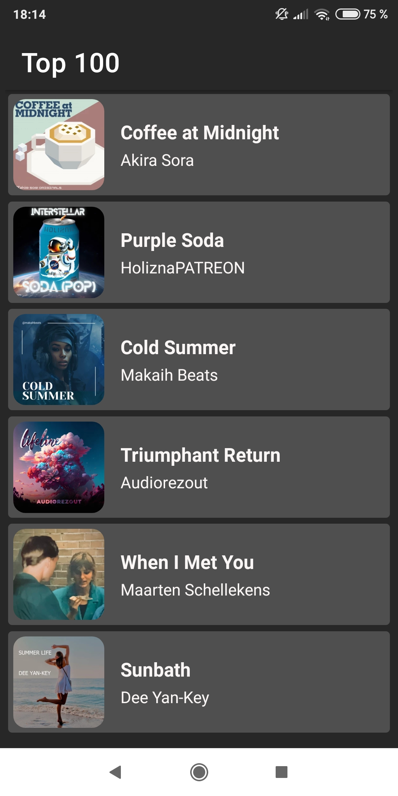
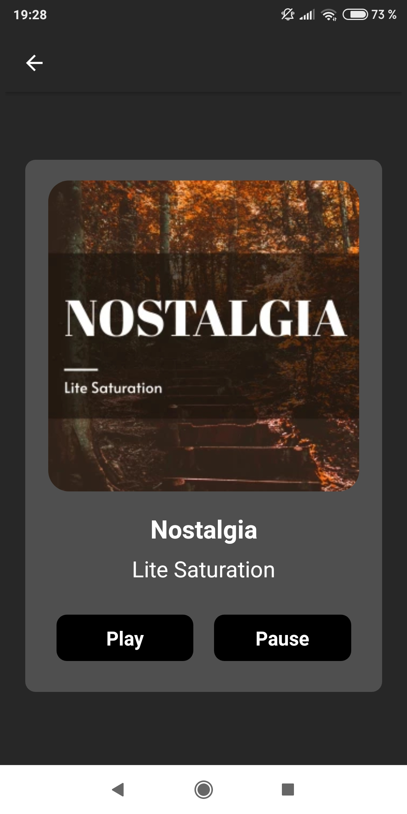

# React Native Ringtone App (Android)

This app allows users to browse and listen to a list of ringtones. It consists of two screens: the "List" screen and the "Details" screen.

### Screen 1: List Screen

The List screen displays a list of 10 ringtones. Users can scroll through the list to view more ringtones. Each ringtone is represented by a title, the artist's name, and an artwork/image.

### Screen 2: Details Screen

The Details screen offers the following features:

- Play Button: Users can play the ringtone by pressing the play button.
- Pause Button: Users can pause the ringtone by pressing the pause button.
- Back Button: Users can return to the List screen by pressing the back button.
- Audio stops playing when the user leaves the Details screen.
- Display Information: The Detail screen displays the title, artist's name, and artwork of the selected ringtone.

#### Sources

- https://freemusicarchive.org/ - audio and artwork

#### Imports

- React
- React Native
- Expo CLI/expo-av
- @react-navigation/stack
- @react-navigation/native

#### Testing

- Expo Web
- Expo Android

### Take a Look with Expo Go

- Download Expo Go from AppStore, register and login in terminal
- Execute 'expo start' in terminal and scan the QR code with it
- Or execute 'expo publish' in terminal, open the link and scan the QR code with your phone's camera

